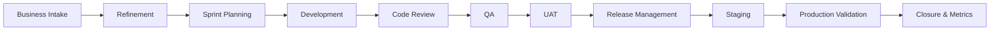

# QA Delivery Lifecycle

## Purpose
A repeatable enterprise delivery model that embeds quality from business intake through post-release validation.

## Quality gates
### Intake → Refinement
- Business objective understood.
- Scope and affected users identified.
- Dependencies and risks captured.

### Refinement → Development
- Acceptance criteria are testable.
- Data, permissions, integrations, and exception paths are considered.
- QA identifies required test coverage before development begins.

### Development → QA
- Development work complete.
- Code review complete where applicable.
- Deployment to QA verified.
- Known limitations documented.

### QA → UAT
- Acceptance criteria validated.
- Critical regression complete.
- Blocking defects resolved or formally accepted.
- UAT scope and tester ownership clear.

### UAT → Release
- Business validation complete.
- Release notes and deployment dependencies ready.
- Production validation plan defined.

### Production → Closure
- Smoke/production validation complete.
- No release-blocking issue remains.
- Defects, lessons learned, and metrics captured.
